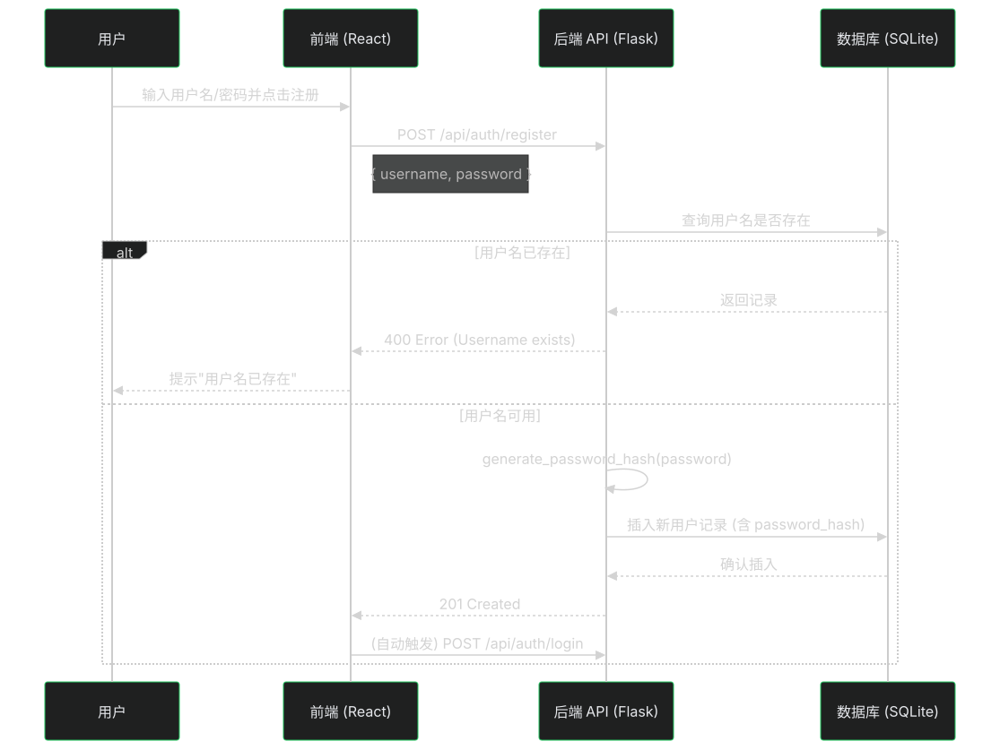
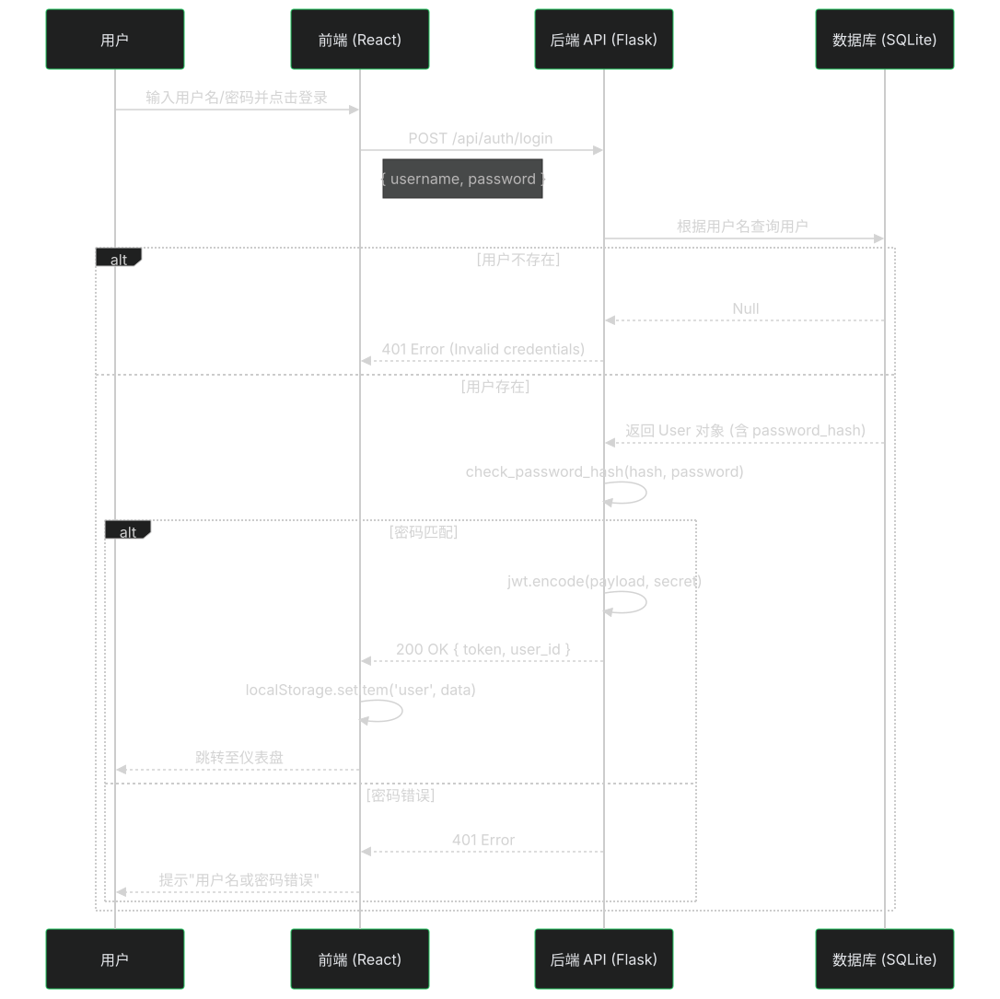

# 认证系统接口文档与实现详解

本文档详细说明了 DataView Pro 项目的后端认证实现机制、API 接口定义以及交互时序图。

## 1. 核心技术栈

后端采用 **Flask** 框架，结合以下库实现安全的身份认证：

- **Werkzeug Security**: 用于密码的哈希（Hash）存储与校验。
  - `generate_password_hash`: 生成加盐的哈希值（如 PBKDF2）。
  - `check_password_hash`: 安全地比对明文密码与数据库中的哈希值。
- **PyJWT**: 用于生成和验证 JSON Web Token (JWT)。
  - Payload 包含 `user_id`、`username` 和过期时间 `exp`。
  - 使用 HS256 算法和密钥（SECRET_KEY）进行签名。

## 2. 数据库设计

在 `dataview.db` (SQLite) 中新增了 `user` 表：

| 字段名          | 类型        | 约束             | 说明               |
| :-------------- | :---------- | :--------------- | :----------------- |
| `id`            | Integer     | Primary Key      | 用户唯一标识       |
| `username`      | String(80)  | Unique, Not Null | 用户名             |
| `password_hash` | String(120) | Not Null         | 加密后的密码字符串 |
| `created_at`    | DateTime    | Default Now      | 注册时间           |

## 3. API 接口定义

### 3.1 用户注册 (Register)

- **URL**: `/api/auth/register`
- **Method**: `POST`
- **Content-Type**: `application/json`

**请求参数**:

```json
{
  "username": "user123",
  "password": "securePassword!"
}
```

**成功响应 (201 Created)**:

```json
{
  "message": "User registered successfully"
}
```

**失败响应 (400 Bad Request)**:

```json
{
  "error": "Username already exists"
}
```

---

### 3.2 用户登录 (Login)

- **URL**: `/api/auth/login`
- **Method**: `POST`
- **Content-Type**: `application/json`

**请求参数**:

```json
{
  "username": "user123",
  "password": "securePassword!"
}
```

**成功响应 (200 OK)**:

```json
{
  "token": "eyJ0eXAiOiJKV1QiLCJhbGciOiJIUzI1NiJ9...",
  "username": "user123",
  "user_id": 1
}
```

**失败响应 (401 Unauthorized)**:

```json
{
  "error": "Invalid username or password"
}
```

## 4. 交互时序图 (Sequence Diagrams)

### 4.1 注册流程



### 4.2 登录流程



## 5. 后端实现细节解析

### 为什么不存明文密码？

如果数据库泄露，明文密码会导致所有用户账户瞬间被盗。我们使用 **Hash（哈希）** 技术。
Hash 是单向函数，无法从结果反推原始密码。

```python
# 注册时：
password_hash = generate_password_hash("mypassword")
# 结果类似: pbkdf2:sha256:260000$....

# 登录时：
is_valid = check_password_hash(stored_hash, "input_password")
```

### 什么是 JWT (JSON Web Token)？

JWT 是无状态的认证机制。服务器不需要在内存中存储 Session。
Token 由三部分组成：`Header.Payload.Signature`。

1.  **Payload**: 存储用户信息（如 `user_id`）。
2.  **Signature**: 服务器用只有自己知道的 `SECRET_KEY` 对内容签名。

当前端随请求发送 Token 时，后端验证签名：

- 如果签名有效 -> 这是一个合法的、未被篡改的 Token -> **放行**。
- 如果签名无效或 Token 过期 -> **拒绝**。

此机制非常适合 RESTful API 和微服务架构。
